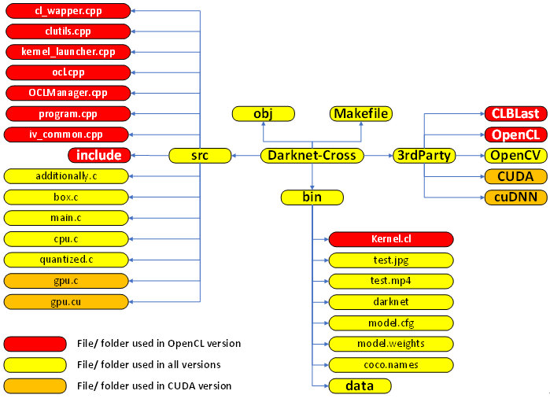
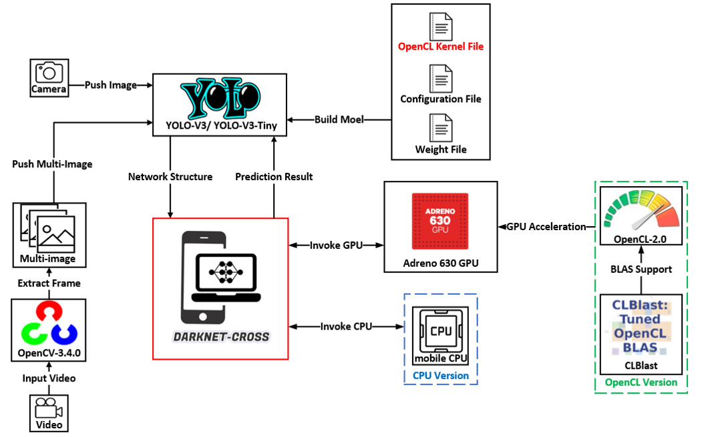

# II. Darknet-Cross Version

Darknet including the following versions:

|Platform|Ubuntu 16.04|Android 8.1.0|
|:--:|:--:|:--:|
|CPU|Darknet-Cross-Ubuntu-CPU|Darknet-Cross-Android-CPU|
|CUDA|Darknet-Cross-Ubuntu-CUDA||
|OpenCL|Darknet-Cross-Ubuntu-OpenCL|Darknet-Cross-Android-OpenCL|

The different version is specified in Makefile.

## 1. Project Structure

### 1.1 Makefile

[Make](https://randu.org/tutorials/c/make.php) is the most commonly used build tool proposed in 1977 and designed mainly for C language projects. The [Makefile](https://www.cs.swarthmore.edu/~newhall/unixhelp/howto_makefiles.html) is used to clarify the build rules. 

This project has defined several variates to assign the specific version in compiling process.

In Makefile, I define 5 version variables:

    ANDROID_CPU = 0
    ANDROID_OPENCL = 0
    UBUNTU_CPU = 1
    UBUNTU_CUDA = 0
    UBUNTU_OPENCL = 0

**Select the version: set the specific version value to 1 and others to 0.**

### 1.2 Source Code Folder

The Source code folder places all the code files for the Darknet-Cross framework. 

#### 1.2.1 File/Folder in All Version

|File/ Folder|Function|
|:--:|:--:|
|main.c|Parse command line instructions, initialize the model, initialize the CPU / OpenCL kernel / CUDA kernel|
|additionally.c|Store the functions related to object detection in original Darknet|
|box.c|Draw a recognition result block diagram on the input image according to the object detection result returned by the network|
|cpu.c|Parse the network structure defined in the configuration file, read the type and parameters of each layer of the network, write the calculation function on the CPU for each type of network and complete the calculation|
|quantized.c|Compile this file to speed up CPU computation|

#### 1.2.2 File/Folder in OpenCL Version

|File/ Folder|Function|
|:--:|:--:|
|include|Folder includes header files used in OpenCL version|
|program.cpp|Use clBuildProgram to compile links to the kernel (compiles & links), and use clGetProgramBuildInfo to get the compilation information of the OpenCL compiler in case of compilation failure|
|iv_common.cpp|Define the type of error returned by the OpenCL error code. Define the image enum string of OpenCV (used to measure the accuracy of each channel in each pixel of the image. The higher the value, the higher the precision).|
|OCLManager.cpp|Initialize OpenCL kernels based on the Kernel.cl file|
|kernel_launcher.cpp|Launch OpenCL kernels in device|
|cl_wapper.cpp|Get the OpenCL platform and device information|
|clutils.cpp|Define assistant functions in OpenCL version|
|ocl.cpp|Parse the network structure defined in the configuration file, read the type and parameters of each layer of the network, write the calculation function of the OpenCL version on the GPU for each type of network and complete the calculation|

#### 1.2.3 File/Folder in CUDA Version

|File/ Folder|Function|
|:--:|:--:|
|gpu.cu|Initialize and manage the CUDA kernels, define the functions used in CUDA version|
|gpu.c|Parse the network structure defined in the configuration file, read the type and parameters of each layer of the network, write the calculation function of the CUDA version on the GPU for each type of network and complete the calculation|

### 1.3. 3rdParty Folder

The 3rdParty Folder places third-party libraries used by Darknet-Cross framework, including: [OpenCV](https://opencv.org/) for video processing, [CUDA](https://developer.nvidia.com/cuda-downloads) and [OpenCL](https://www.khronos.org/opencl/) for invoking GPU, [cuDNN](https://developer.nvidia.com/cudnn) for accelerating CUDA deep learning calculations,  [CLBlast](https://github.com/CNugteren/CLBlast) for accelerating OpenCL linear algebra calculations.

### 1.4. Object Folder

The compilation process is compiled into a binary object file according to the current source code. The link process is to link the generated object file with the library file and other files to generate an executable file (.exe file).

The object file generation rules are specified by the Makefile and the .o files are stored in the Object folder.

### 1.5. Bin Folder

The Bin folder contains the generated executable file, the YOLO model configuration file, the weight file, the image and MP4 files used for testing. For the OpenCL version, Kernel.cl and executable file need to be placed in the same folder for the executable file to read and launch the OpenCL kernel during execution. 

## 2. Workflow

### 2.1 Ubuntu Version

- **Input stage:** the input files include the multi-media file (image or video) for object detection and the model file (model configuration file and well-trained weights file) for rebuilding the network structure of YOLO-V3/ YOLO-V3-Tiny. OpenCV is needed to decode and extract frames if the input file is video.
- **Build network stage:** YOLO-V3/ YOLO-V3-Tiny model will be rebuilt based on the configuration file and the weight file. The model structure will be stored in network struct (defined in additionally.h file).
- **Calculate stage:** the Darknet-Cross framework will accomplish the object detection for the input file based on YOLO-V3/ YOLO-V3-Tiny. The specific devices (CPU/ GPU-CUDA/ GPU-OpenCL) will assist the computation and increase the processing speed.
- **Return result stage:** the prediction result will be returned and displayed on the screen by using functions in OpenCV.

### 2.2 Android Version

Stages in Android version is similar as the Ubuntu platform with several differences:

- The Android version does not support object detection in video file, since the decoder used in OpenCV is not embedded in Android. In Ubuntu version, OpenCV uses VideoCapture class to decode the input video file. However, this class is based on decoder like [FFmpeg](https://www.ffmpeg.org/), which is hard to transplant on Android platform directly. Thus, the Android version cannot process video in this stage since the lack of back-end software in underlying environment. (This project only tests the Darknet-Cross framework in cross-compiling mode, which is an underlying environment in Android. However, the Android Application mode may support the embed of FFmpeg in JAVA level.) But the Darknet-Cross framework supports object detection for a series of images. Thus, multi-images can be used to test the acceleration performance in Adreno 630 GPU. The performance in multi-image processing is equal to the video processing, more information will be shown in the  [Darknet-Cross Performance](https://github.com/huuuuusy/Darknet-Cross/blob/master/introduction/Performance.md) part.
- The Android version uses OpenCL-2.0 rather than OpenCL-1.2, since this version is defined by the mobile phone developer in OpenCL driver.
